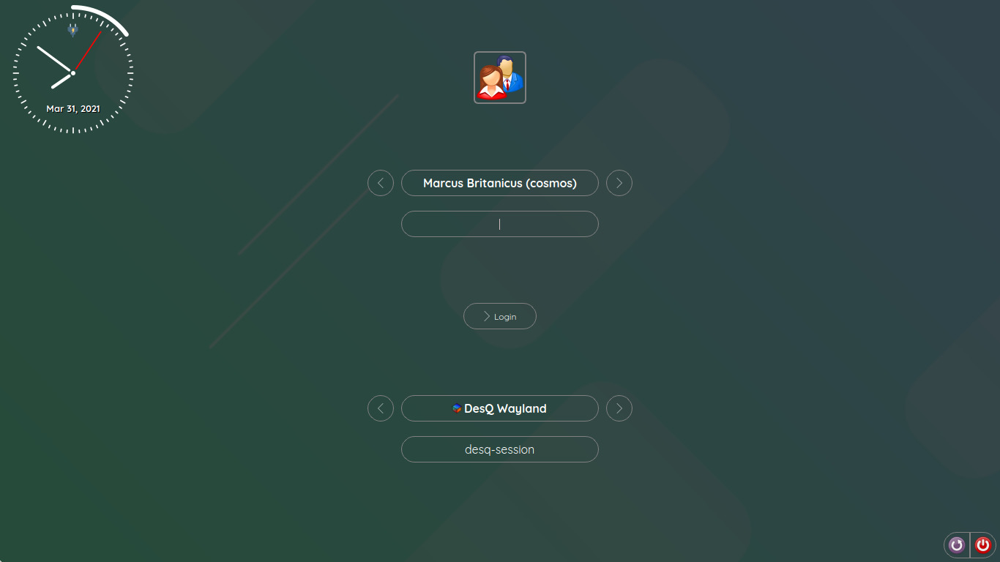
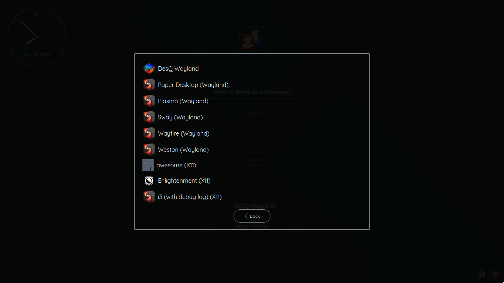
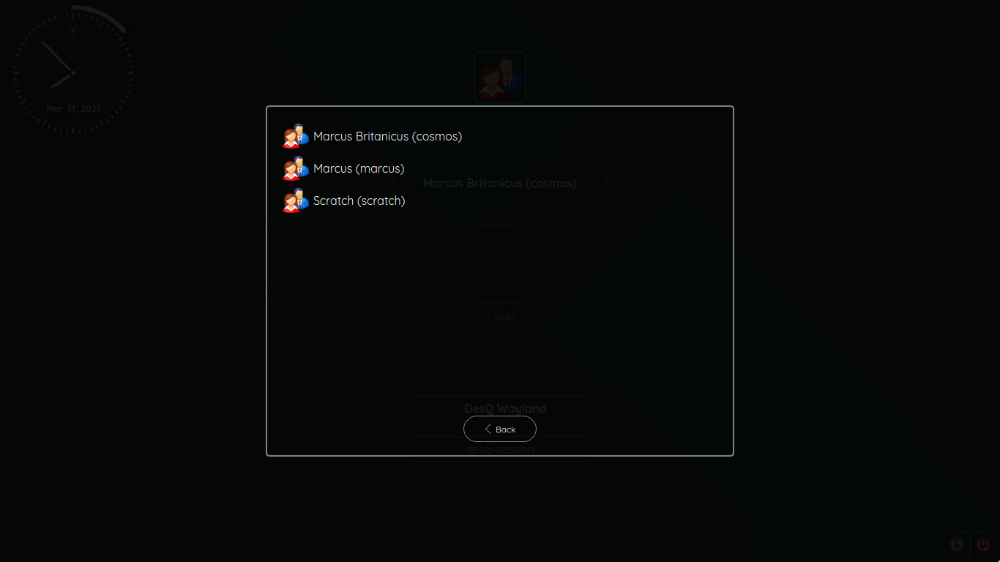

# QtGreet
Qt based greeter for [greetd](https://git.sr.ht/~kennylevinsen/greetd), to be run under wayfire or similar wlr-based compositors.

Connect with us via [Matrix/IRC](https://app.element.io/#/room/#qtgreet:matrix.org) (#qtgreet:matrix.org)

<br /><br />
<br /><br />


### Dependencies:
- Qt5 (duh...)
- Qt5Wayland
- WLR based compositor (wayfire, sway etc..)
- CMake (to build this project)
- Make or Ninja (to compile this project)

### Compiling and installing

- Get the sources of QtGreet
  * Git: `git clone https://gitlab.com/marcusbritanicus/QtGreet.git`
- Enter the `QtGreet` folder
  * `cd QtGreet`
- Create the build folder and enter it
  * `mkdir .build && cd .build`
-  Generate the make file using CMake
  * `cmake .. `
  * If you wish to use `ninja`, add `-GNinja` at the end of the above command
- Compile and install the project
  * Make: `make -kj$(nproc) && sudo make install`     
  * Ninja: `ninja -j 4 -k 0 && sudo ninja install`

### Configure greetd to run QtGreet using wayfire

If you wish to make use of greetd, then you will have to configure it to use QtGreet.
To use wayfire, you'll have to set the command `greetd` should run as `wayfire --config /etc/qtgreet/wayfire.ini`
* Open `/etc/greetd/config.toml` for editing with your favorite editor.
* Under `[default_session]`, set `command = "wayfire --config /etc/qtgreet/wayfire.ini"`

### Configuring the keyboard layout for wayfire
Sometimes, it would be easier if the keyboard layout was not the default `us`. For wayfire, simply add the following line at the end of
`/etc/qtgreet/wayfire.ini` file:

```ini
[input]
xkb_layout = us
```
