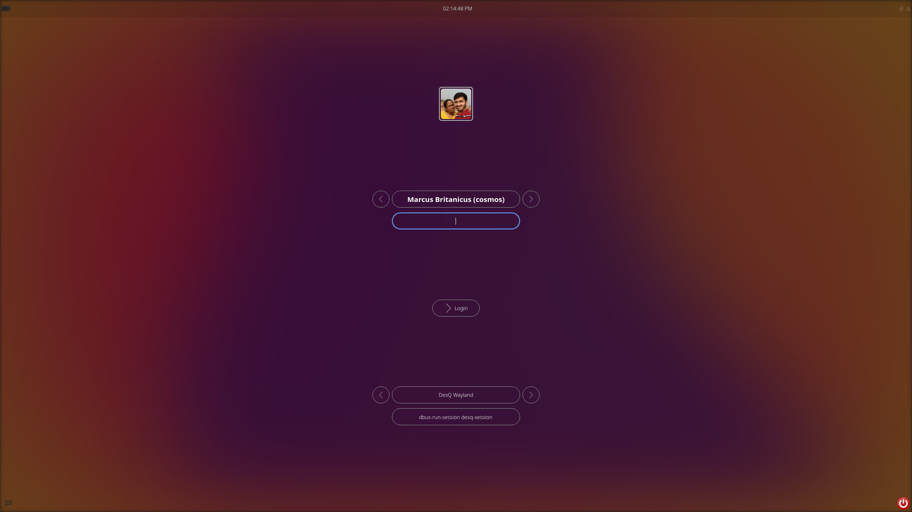
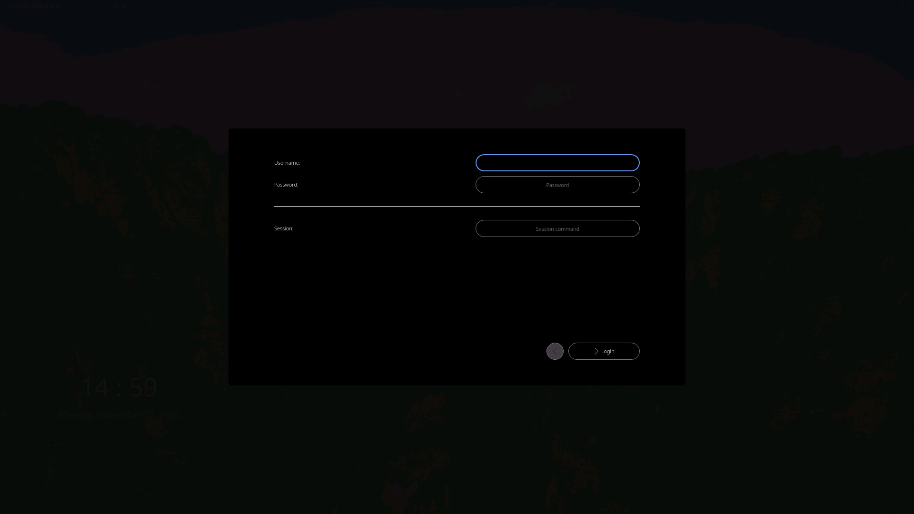

# QtGreet

#### Note: Github is a read-only mirror. You can open PRs and issues at [GitLab](https://gitlab.com/marcusbritanicus/QtGreet.git).

Qt based greeter for [greetd](https://git.sr.ht/~kennylevinsen/greetd), to be run under wayfire or similar wlr-based compositors.

Connect with us via [Matrix/IRC](https://app.element.io/#/room/#qtgreet:matrix.org) (#qtgreet:matrix.org)

<br /><br />
<br /><br />


### Dependencies:
- Qt5 or Qt6 (duh...)
- WayQt (https://gitlab.com/desktop-frameworks/wayqt.git)
- DFL::Applications (https://gitlab.com/desktop-frameworks/applications.git)
- DFL::IPC (https://gitlab.com/desktop-frameworks/ipc.git)
- DFL::Utils (https://gitlab.com/desktop-frameworks/utils.git)
- DFL::Login1 (https://gitlab.com/desktop-frameworks/login1.git)
- wlroots (https://gitlab.freedesktop.org/wlroots/wlroots.git)
- A wayland based compositor (wayfire, sway, labwc etc..) - Optional
- Meson (to build this project)
- Ninja (to compile this project)

**Note:** wlroots is needed only if you are compiling `greetwl`. If you want to skip the compilation of `greetwl`,
pass `-Dbuild_greetwl=false` to `meson`

### Compiling and installing

- Get the sources of QtGreet
  * Git: `git clone https://gitlab.com/marcusbritanicus/QtGreet.git`
- Enter the `QtGreet` folder
  * `cd QtGreet`
- Configure the project - we use meson for project management
  * `meson .build --prefix=/usr --buildtype=release`
- Compile and install - we use ninja
  * `ninja -C .build -k 0 -j $(nproc) && sudo ninja -C .build install`

### Configure greetd to run QtGreet

If you wish to make use of greetd, then you will have to configure it to use QtGreet.
You can either use the *inbuilt* `greeetwl` compositor (a fork of `tinywl`), or use a full-fledged compositor like wayfire or sway.

- To use `greetwl` compositor,
  * Open `/etc/greetd/config.toml` for editing with your favorite editor.
  * Under `[default_session]`, set `command = "greetwl"`

- To use wayfire,
  * Open `/etc/greetd/config.toml` for editing with your favorite editor.
  * Under `[default_session]`, set `command = "wayfire --config /etc/qtgreet/wayfire.ini"`

- Similarly for sway,
  * Open `/etc/greetd/config.toml` for editing with your favorite editor.
  * Under `[default_session]`, set `command = "sway --config /etc/qtgreet/sway.cfg"`

- For labwc,
  * Open `/etc/greetd/config.toml` for editing with your favorite editor.
  * Under `[default_session]`, set `command = "labwc -s 'qtgreet && wayland-logout'"`

Most compositors print debug messages to the terminal. You can hide them by redirecting the debug output. Add ` > /dev/null 2>&1` at the end of
each command (ex. `command = "greetwl > /dev/null 2>&1"`).

Custom login prompt can be activated by pressing `[Ctrl] - [Alt] - [X]` key combination.

### CLI Options
Following command-line options are available:
```
  -h, --help                               Displays help on commandline options.
  -v, --version                            Displays version information.
  -c, --config <cfgfile>                   Configuration file (Default: /etc/qtgreet/config.ini)
  -d, --data-path <datafile>               Path to store dynamic data (Default: /var/lib/qtgreet/)
  -w, --wl-session-path <path1;path2;...>  Path(s) containing wayland session desktops  (Default: /usr/share/wayland-sessions)
  -x, --x-session-path <path1;path2;...>   Path(s) containing x11 session desktops  (Default: /usr/share/xsessions)
  -p, --passwd-path <passwd>               Path to passwd  (Default: /etc/passwd)
  -l, --login-defs-path <login>            Path to login.defs  (Default: /etc/login.defs)
  -r, --xserver-path <xrc-path>            Path to xserverrc  (Default: /etc/X11/xinit/xserverrc)
  -t, --tmp-path <tmp>                     System temp folder (Default: /tmp)
  -n, --vt-number <vtnr>                   VT number where the session is started (Default: 1; applicable for X11 only)
  -o, --log-path <log-path>                Path to store log files (Default: /var/tmp/qtgreet)
```

If you're using `greetwl` as the compositor, you can pass these options to `greetwl` which will forward them to `qtgreet`.

### Configuring the keyboard layout for wayfire
Sometimes, it would be easier if the keyboard layout was not the default `us`. For wayfire, simply add the following line at the end of
`/etc/qtgreet/wayfire.ini` file:

```ini
[input]
xkb_layout = us
```
``
