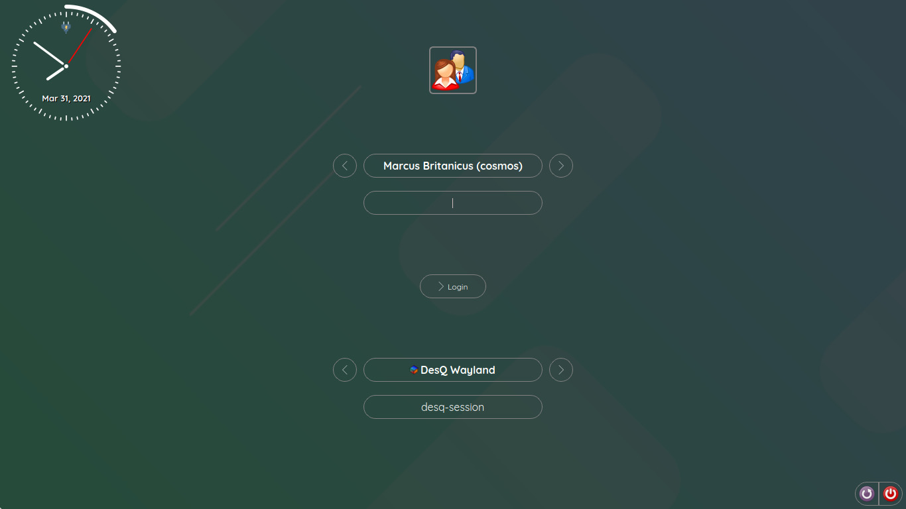

# QtGreet
Qt based greeter for [greetd](https://git.sr.ht/~kennylevinsen/greetd), to be run under wayfire or similar wlr-based compositors.

Connect with us via [Matrix/IRC](https://app.element.io/#/room/#qtgreet:matrix.org) (#qtgreet:matrix.org)

### Dependencies:
- Qt5 (duh...)
- wlroots
- WLR based compositor (wayfire, sway etc..)
- CMake (to build this project)
- Make (to compile this project)
- Cargo (to build greetd)
- Rust (to compile greetd)

### Compiling and installing

- Get the sources of QtGreet
  * Git: `git clone https://gitlab.com/marcusbritanicus/QtGreet.git`
- Enter the `QtGreet` folder
  * `cd QtGreet`
- Now you can simply type to update and build QtGreet and greetd
  * `./setup.py prepare && ./setup.py build`
  * In case you want to disable `greetd`, use the `--no-greetd` switch,
    - `./setup.py prepare --no-greetd && ./setup.py build --no-greetd`
- Install the project (again, use `--no-greetd` to avoid greetd installation)
  * `sudo ./setup.py install`

### Configure greetd to run QtGreet using wayfire

In case greetd was not installed as a part of QtGreet, then you will have to configure it to use QtGreet.
You can skip this if greetd was installed as a part of QtGreet installation.
To do that, you'll have to set the command `greetd` should run as `wayfire --config /etc/qtgreet/wayfire.ini`
* Open `/etc/greetd/config.toml` for editing with your favorite editor.
* Under `[default_session]`, set `command = "wayfire --config /etc/qtgreet/wayfire.ini"`

### Configuration of QtGreet

- We first paint a base color over the entire screen over which the wallpaper is drawn with 50% opacity. This helps to improve the legibility of
the text. Currently, three configuration options are available: `Background`, `BaseColor`, and `TextColor`
- You can set these in `/etc/qtgreet/config.ini` file.
- `BaseColor` key defines the base color to be painted. It takes ARGB hex values as single continuous string.
  * Ex: ffffffff (white, alpha = 100%), AAFF0000 (red, alpha = 66.6%), 00008080 (teal, alpha = 0), and so on.
  * The default value is white (ffffffff).
- `Background` key defines the background image. All image formats supported by Qt on your system are supported by QtGreet. Typically
jpg/png/svg files should be fine. Some default background files can be found in /usr/share/qtgreet/backgrounds. The path should be absolute.
- If you wish not to use a background image, you may set `Background = none`, in which case only the base color will be painted on the screen.
- `TextColor` key defines the color of the text. The default value is white. It takes RGB hex values as single continuous string similar to
`BaseColor`.
  * The default value is white (ffffff).

### Tips and tricks

- The users are automatically divined from `/etc/passwd`, UID_MIN and UID_MAX are read from `/etc/login.defs`.
- The users are sorted alphabetically.
- You may select the user by pressing the left/right buttons available on either side of the user name.
- Alternatively, the user can click on the username (it's a button) - and select the user from the dialog.
- The sessions are read from `/usr/share/wayland-sessions` first, then from `/usr/share/xsessions`
- You may select the sessions by pressing the left/right buttons available on either side of the session name.
- Alternatively, the user can click on the session name (it's a button) - and select the session from the dialog.
- An option to enter custom command is available at the end.
- The field below the session name shows the command that will be run. If you select the session as "Custom",
  you'll be able to enter the command.
